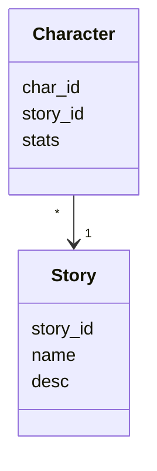
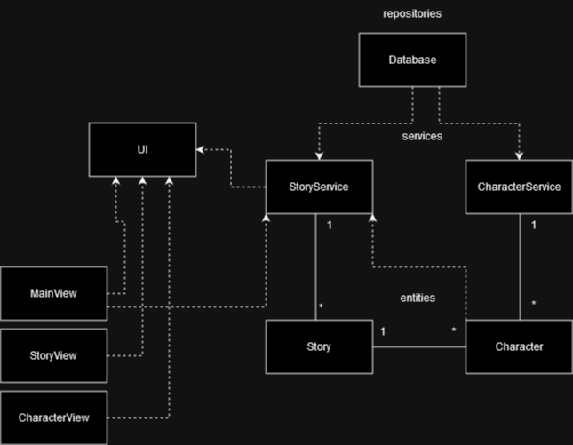
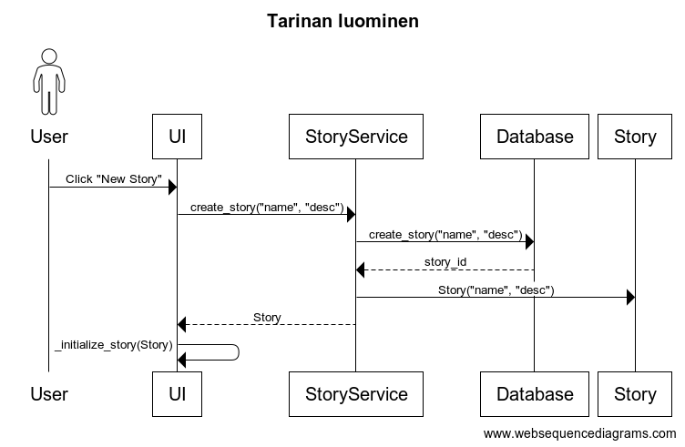
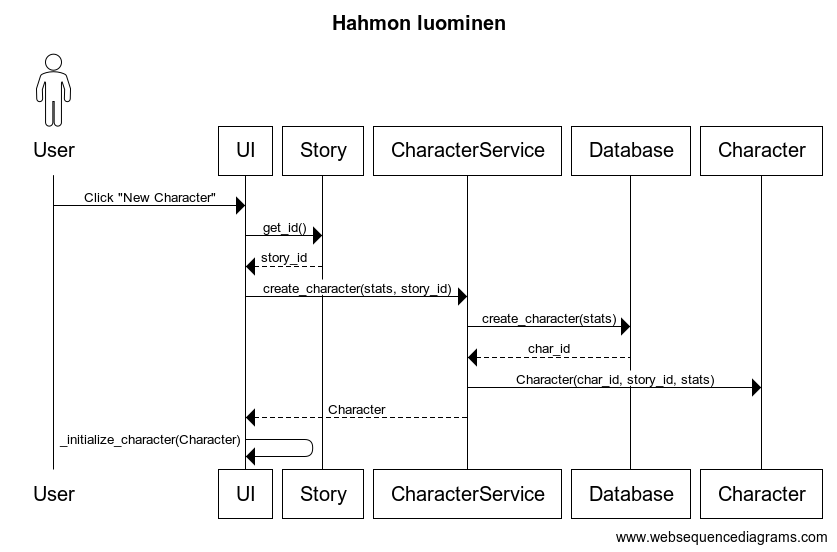

# Arkkitehtuuri

## Rakenne

Ohjelma sisältää seuraavat pakkaukset:
- data
- entities
- library
- repositories
- services
- ui

*Data* sisältää tietoa, kuten tietokantaa ja pysyvää tietoa, jota ei muokateta ohjelman suorituksessa. *Entities* sisältää yksittäisten objektien luokkia, kuten ```Character``` (Hahmo) tai ```Story``` (Tarina). *Library* sisältää kuvia, jotka tallennetaan hakemistoon. *Repositories* vastaa tietojen tallennuksesta ja hallitsemisesta tietokannassa ja *library*-hakemistossa. *Services* vastaa sovelluslogiikasta ja pakkauksessa *ui* löytyy käyttöliittymän koodi.

## Sovelluslogiikka

Sovelluksessa pääolioina on luokat [Story](https://github.com/Uxusino/ot-characters/blob/main/characters/entities/story.py) ja [Character](https://github.com/Uxusino/ot-characters/blob/main/characters/entities/character.py), jotka kuvaavat tarinoita ja tarinoiden hahmoja.



Tarinoita ja hahmoja käsiteltävät luokat ovat [StoryService](https://github.com/Uxusino/ot-characters/blob/main/characters/services/story_service.py) ja [CharacterService](https://github.com/Uxusino/ot-characters/blob/main/characters/services/character_service.py). Nämä sovelluslogiikan luokat yhdistävät tietokantaa ja ohjelman olioita luokkien [Database](https://github.com/Uxusino/ot-characters/blob/main/characters/repositories/db_management.py) ja [Repository](https://github.com/Uxusino/ot-characters/blob/main/characters/repositories/file_management.py) avulla.

Palveluluokat tuovat metodeja tarinoiden ja hahmojen hallintaan, tallentamiseen ja tietojen saamiseen. Käyttöliittymä pääosin käyttää ```StoryService```- ja ```CharacterService```-luokat kaikkeen ohjelman sisäiseen toiminnallisuuteen. Palveluluokat ovat toisistaan riippumattomia ja kaikki tekevät oman tehtävänsä.

Esimerkkejä palveluluokkien metodeista:
- ```py create_character(info, story_id)```
- ```py set_relations(char1, char2, relation, former)```
- ```py clear_characters()```
- ```py get_stories()```
- ```py count_stories()```



## Toiminnallisuudet

### Uuden tarinan luominen



### Uuden hahmon luominen

