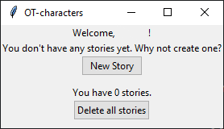
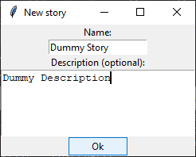
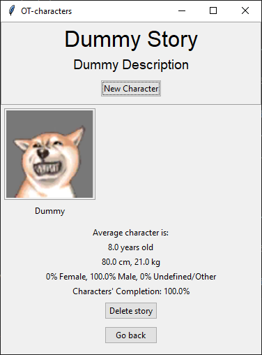

# Käyttöohje

## Asentaminen ja käynnistäminen

1. Asenna riippuvuudet:

```
poetry install
```

2. Alusta kaikki tarvittavat tiedostot:

```
poetry run invoke build
```

3. Käynnistä ohjelma:

```
poetry run invoke start
```

## Uuden tarinan luominen

Sovelluksen käynnistyksen jälkeen ilmestyy seuraava näkymä:



Uutta tarinaa voi luoda painamalla *"New Story"*-painiketta. Painiketta painamalla avautuu uusi ikkuna. Uuden tarinan luominen onnistuu syöttämällä tarinan nimen ja kuvauksen alla oleviin kenttiin ja painamalla *"Ok"*-painiketta.



Tämän jälkeen ikkunassa näkyy uuden tarinan nimi painikkeena. Sitä painamalla näkymä siirtyy kyseisen tarinan sivulle.

## Uuden hahmon luominen

Täältä näyttää tyhjä tarina:


Painamalla *"New Character"*-painiketta pääsee hahmon luomisen ikkunaan.


Hahmon tietoja voi kirjoittaa seuraaviin kenttiin:
- **Name**: Hahmon nimi. Nimen pituuden yläraja on 30 kirjainta.
- **Gender**: 3 valintaa: *Female*, *Male* tai *Unknown*.
- **Birthday**: Sisältää kolme kenttää: päivän, kuukauden ja vuoden. Päivä ja kuukausi voivat pituudeltaan olla enintään 2 symbolia. Kaikkien arvojen tulee olla numeerisia.
- **Age**: Numeerinen kokonaisluku.
- **Height**: Numeerinen kokonaisluku senttimetreinä.
- **Weight**: Numeerinen kokonaisluku kilogrammoina.
- **Appearance**: Hahmon ulkonäön kuvaus.
- **Personality**: Hahmon luonteen kuvaus.
- **History**: Mitä hahmolle tapahtuu tarinan aikana.
- **Image**: Kuvan valitseminen omasta tietokoneesta. Kuvan koko muutetaan kooksi 150x150.
- **Trivia**: Mahdollisia lisätietoja hahmosta.

Mikään kenttä ei ole pakollinen ja halutessaan voi luoda tyhjänkin hahmon. Syötettyään kaikki tarvittavat tiedot uuden hahmon luonti onnistuu painamalla *"Ok"*-painiketta.

## Pääsy hahmon sivulle

Uusi luotu hahmo näkyy tarinan näkymässä neliönä.



Hahmon sivulle pääsee klikkaamalla sen kuvaa.


## Uuden suhteen lisääminen

Uutta suhdetta pääsee lisäämään painamalla *"Add Relation"*-painiketta. Uusi suhde voi luoda joko toisen tai saman hahmon kanssa. Täytyy valita hahmo ja haluttu suhde.


Jos suhde on kaksisuuntainen, toisen hahmon sivu päivittyy automaattisesti.


## Hahmon tietojen muokkaaminen

On mahdollista vapaasti muokata hahmon tiedot. Pitää yksinkertaisesti painaa muokatettavaa tietoa; sen jälkeen kun päivittää kaikki tarvittavat kohdat, pitää painaa "Save Changes"-nappia ja tiedot tallentuvat tietokantaan.


Kuvaa pääsee muokkamaan painamalla hahmon profiilikuvaa. Sitä ei tarvitse erikseen tallentaa, sillä kuva päivittyy heti, kun valitsee sitä.

## Suhteiden poistaminen

Suhteita voi poistaa klikkaamalla niitä. Silloin kun suhde on valittu, teksti muuttuu lihavoiduksi.

