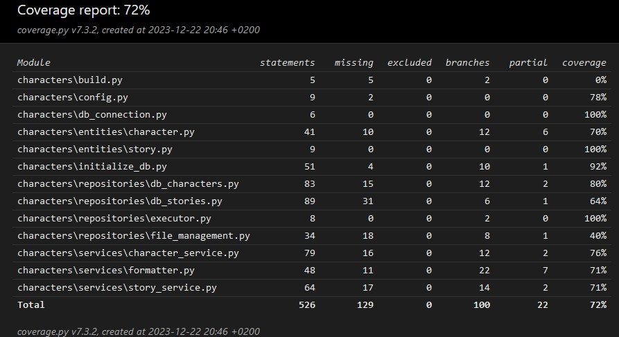

# Testaus

Ohjelma on testattu unittestin avulla sekä myös manuaalisesti käyttöliittymästä.

## Yksikkö- ja integraatiotestaus

### Sovelluslogiikka

Sovelluslogiikan luokkia `StoryService` ja `CharacterService` on testattu erillisillä testiluokilla [TestStoryService](https://github.com/Uxusino/ot-characters/blob/main/characters/tests/story_service_test.py) ja [TestCharacterService](https://github.com/Uxusino/ot-characters/blob/main/characters/tests/character_service_test.py). `TestCharacterService` on laajempi; hahmojen lisäksi se testaa myös suhteiden liittyviä metodeja.

### Repositorio-luokat

Repositorioluokista yksikkötesteissä käydään ainoastaan tietokantaan liittyviä luokkia `CharactersDatabase` ja `StoriesDatabase`, sillä ne ovat täysin yhteydessä sovelluslogiikan luokkien kanssa. Testeissä käytetään *.env.test* -tiedostossa määriteltyä testitietokantaa.

### Testikattavuus

Haarautumakattavuus on 72%. Suuri osa toiminnallisuutta oli testattu käsin käyttöliittymästä.

## Järjestelmätestaus

### Asennus

Sovellus on asennettu ja testattu manuaalisesti Windows 10- ja Linux-ympäristöllä.

Sovelluksessa on testattu erilaisia syöttöjä, virheellisiä tai tyhjiä. On testattu myös sellaisia tilanteita, jossa kuvat ovat voineet jäädä poistamatta hahmon poistamisen jälkeen.

## Laatuongelmat

Sovellus ei anna virheilmoituksia esim. kun tarinan nimi tai kuvaus ovat liian pitkiä, vaan se sallii painamaan OK-nappia vain silloin kun syöttö on kunnossa. Ei testattu, mitä tapahtuu, jos tietokannan alustus oli virheellinen tai tietokantaa ei alustettu ollenkaan.